# Shadcn Page Collector

Collect blocks and visual references from any website, arrange a page outline, and hand the result to Codex, Claude Code, or another coding agent as a numbered local package.

[](https://developer.chrome.com/docs/extensions/develop/migrate/what-is-mv3)
[](https://github.com/ochernishov/shadcn-pagebuilder-chrome/actions/workflows/ci.yml)
[](#languages)
[](LICENSE)

> Shadcn Page Collector is not affiliated with shadcn/ui, Shadcn Blocks, or any other source library. It captures only what the user can already see and never bypasses subscriptions, authentication, paywalls, or licensing restrictions.

## What it does

The extension separates visual research from implementation. **Page** mode saves source pages, selected text, notes, and screenshots into an ordered page specification. Clicking **Finish page** creates a package such as `Collector/482731/` inside the chosen project. **One block** mode prepares a standalone reference that can be pasted directly into Codex, Claude Code, or another coding agent without changing the page collection.

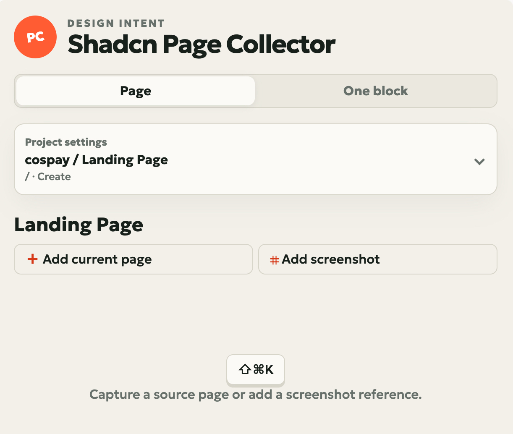

```text
Chrome reference collection
        ↓
<project>/Collector/482731/
        ↓
$shadcn-collector 482731
        ↓
Codex or Claude Code implements the page
```

## Features

- Capture a source page from any HTTP or HTTPS website with `⇧⌘K` on macOS, `Alt+Shift+B` elsewhere, or the context menu. The shortcut captures the active page without opening or closing the side panel; use the extension icon to open the panel.
- Switch between independent **Page** and **One block** workflows without losing the collected page or either unfinished capture draft.
- Prepare one standalone block as structured JSON for a coding agent; when a screenshot is included, Collector also writes its PNG representation to the clipboard where supported.
- Add an optional visible-tab screenshot to a captured source.
- Click **Add screenshot**, drag over any visible area, and add the cropped PNG as its own ordered visual reference.
- Use the two explicit actions below the page name to add the current source page or capture a selected screenshot region.
- Store source URL, title, hostname, selected text, semantic section type, position, and implementation notes.
- Mix installable blocks and screenshot-only references in the same page.
- Reorder, remove, expand, preview, and reopen every saved item.
- Edit and save implementation notes inside any expanded page item; updated notes flow into copied prompts, JSON, Markdown, and the next numbered export.
- Detect duplicate source URLs and open the existing item instead of adding it twice.
- Keep one current page collection at a time, with no hidden project or page backlog inside the extension.
- Select the real project directory with the native macOS folder picker.
- Mark a page as **Create** or **Edit** and preserve its target route.
- Collapse project settings into a compact summary of the project, page, route, and Create/Edit intent so the page-building workspace stays primary.
- Export `PAGE_SPEC.md`, `page-spec.json`, and PNG references into an isolated six-digit package.
- Install the shared `shadcn-collector` skill for both Codex and Claude Code.
- Use the complete interface and exported instructions in English, Russian, French, Italian, or Chinese.
- Keep browser state, project paths, notes, screenshots, and finished packages local.

## Free, paid, and unavailable sources

Collector records factual references; it does not decide what the implementation agent is allowed to install.

| Source situation | What Collector saves | What the coding agent should do |
|---|---|---|
| Free or open-source library | Visible page metadata, URL, notes, optional screenshot | Use an official package or registry when compatible with the project and license |
| Paid library you own | The same visible reference data; legacy official install metadata is preserved when present | Use the official installer only if the user's local environment is already authorized |
| Paid library you do not own | URL, visible screenshot, selected text, and design intent only | Create an original implementation from the visible reference; do not bypass access controls or copy proprietary code |
| Ordinary website, gallery, or app | A selected screenshot region, URL, and notes | Recreate the relevant idea as an original, project-specific implementation |

No library API key is required by Collector. Credentials remain in the user's authorized project or official library tooling and are never copied into a collection.

## Install on macOS

### From a GitHub Release

Requirements: macOS, Google Chrome, and [Node.js 20 or newer](https://nodejs.org/).

1. Download `Shadcn-Page-Collector-v0.10.0.zip` from the latest GitHub Release.
2. Unzip the archive.
3. macOS quarantines every downloaded file, so opening **Install on macOS.command** directly is blocked with "Apple could not verify..." and no **Open** option — recent macOS removed the Control-click bypass for scripts. Clear the quarantine flag once in Terminal before running it:
   ```bash
   xattr -dr com.apple.quarantine ~/Downloads/Shadcn-Page-Collector-v0.10.0
   ```
   (Type `xattr -dr com.apple.quarantine ` in Terminal, then drag the unzipped folder into the window to fill in its path, and press Return.) Then double-click **Install on macOS.command**.
4. Chrome opens `chrome://extensions`. Enable **Developer mode**.
5. Click **Load unpacked** and select `~/Library/Application Support/Shadcn Page Collector/extension` — the installer copies the extension there, so this path stays the same across updates and does not depend on where you unzipped or downloaded the archive.
6. Open `chrome://extensions/shortcuts`, find **Shadcn Page Collector — Capture the active page**, and verify its shortcut. On macOS, click the pencil and press `Command+Shift+K` if the field is empty.
7. On the first **Add current page** or **Add screenshot** click, accept Chrome's website-access request. Collector needs it to reach the tab from the side panel.
8. Pin the extension if desired, then restart Codex or Claude Code once so it discovers the installed skill.

The installer copies the Native Messaging host and the extension itself into `~/Library/Application Support/Shadcn Page Collector/` and installs the same public skill into `~/.codex/skills/shadcn-collector/` and `~/.claude/skills/shadcn-collector/`. The downloaded archive and its unzipped folder may be deleted right after step 5 — Chrome loads the extension from the permanent copy, not from the download.

Chrome Web Store distribution is not included yet, so the one remaining browser step is **Load unpacked**.

### From source

```bash
git clone https://github.com/ochernishov/shadcn-pagebuilder-chrome.git
cd shadcn-pagebuilder-chrome
cp .env.example .env
npm run setup
```

Then open `chrome://extensions`, enable **Developer mode**, click **Load unpacked**, and select `dist/extension`.

Open `chrome://extensions/shortcuts` and verify that **Capture the active page** is assigned to `Command+Shift+K` on macOS or `Alt+Shift+B` on other platforms.

The public SPKI key in `.env.example` only keeps the unpacked extension ID stable. It is intentionally public and is not a credential.

### Update or remove

For an update, download and unzip the new release, run **Install on macOS.command** again, and click **Reload** on the extension card in `chrome://extensions` — the installer overwrites the same permanent copy, so **Load unpacked** does not need to be repeated. Then check `chrome://extensions/shortcuts`: Chrome may leave a renamed or conflicting extension command unassigned instead of transferring the old shortcut.

### Keyboard shortcut

The shortcut and the toolbar icon intentionally perform different actions:

- `Command+Shift+K` on macOS (`Alt+Shift+B` elsewhere) captures the active page without opening or closing the side panel.
- The toolbar icon opens or closes the side panel.

Chrome does not guarantee that a suggested shortcut is assigned when another extension already uses it or when a command changes during an update. If capture does not run:


1. Paste `chrome://extensions/shortcuts` into the Chrome address bar.
2. Find **Shadcn Page Collector**.
3. Click the pencil beside **Capture the active page**.
4. Press `Command+Shift+K`, or choose another free combination if Chrome reports a conflict.
5. Test the command on a normal HTTP/HTTPS page, not on an internal `chrome://` page.

The **Add current page** button below the page name always provides the same capture action without a keyboard shortcut.

To remove Collector completely:

1. Remove the extension from `chrome://extensions`.
2. From the downloaded package or source checkout, run `node scripts/uninstall-host.mjs`. This also deletes the permanent copy at `~/Library/Application Support/Shadcn Page Collector/`.
3. Finished `Collector/` folders are user data and are not deleted automatically.

## Usage

Choose **Page** or **One block** directly below the application title. Switching modes preserves the page outline, the standalone result, and unfinished drafts independently.

### Collect a page

1. Open the collector and choose a project folder.

The native macOS picker connects Collector to the real project directory where the numbered package will be written.

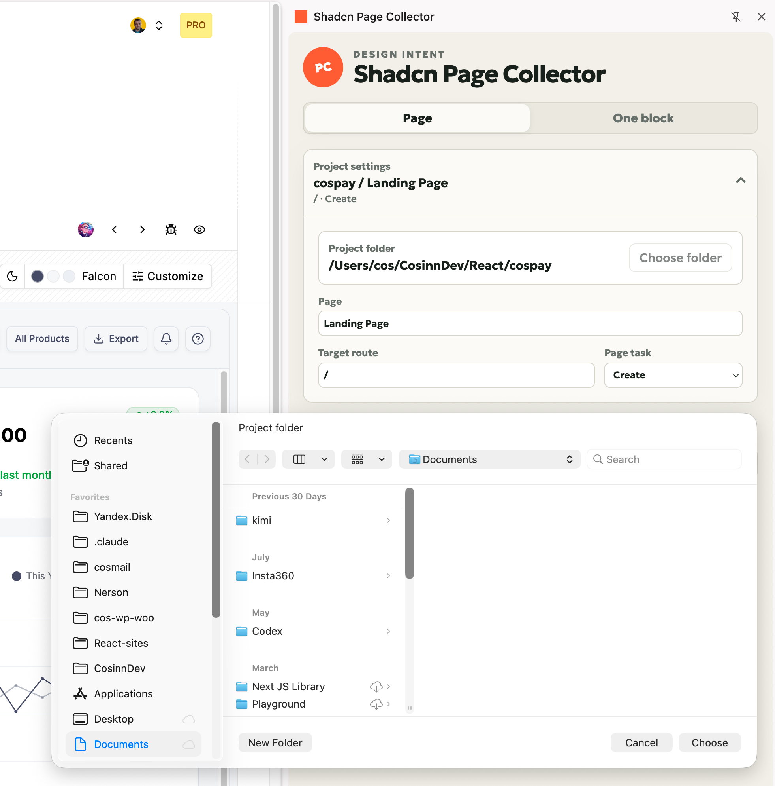

2. Enter the page name, route, and **Create/Edit** intent.

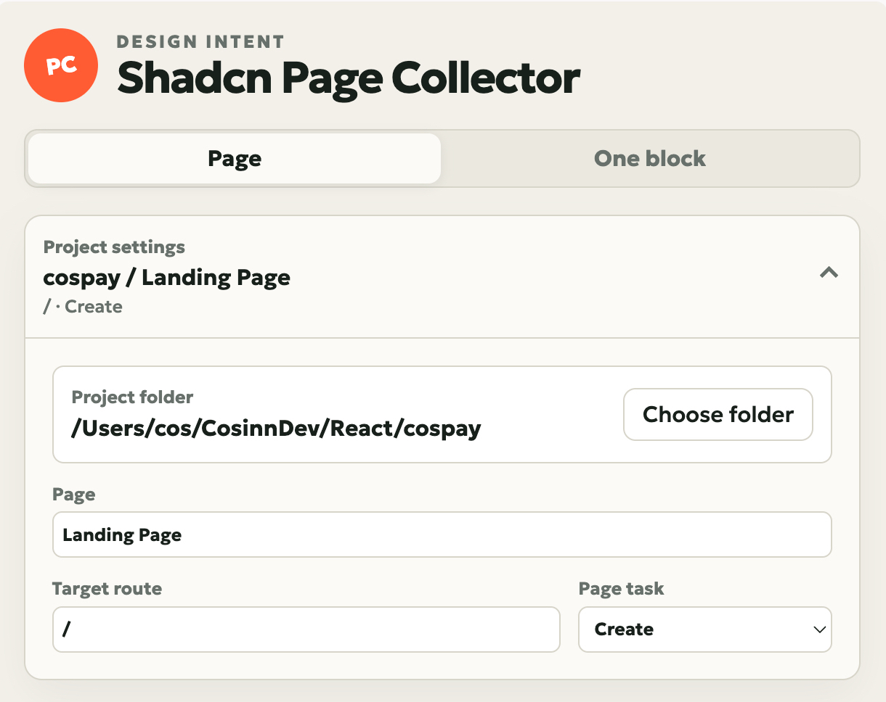

Project settings collapse after setup, keeping the page actions and collected outline in focus.

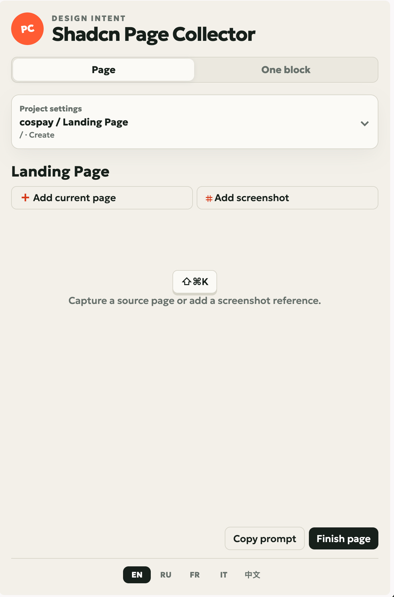

3. Open a block, component, or reference page.
4. Click **Add current page**, press `⇧⌘K`, or use **Add to Shadcn Page Collector** in the context menu. All three prepare the active page without toggling the panel; click the extension icon whenever you need to open the panel.
5. Choose the semantic section type, position, notes, and whether to include a screenshot; then click **Add block** or **Discard**.

Collector stores the source URL and your implementation intent. A visible screenshot can travel with the reference, but no hidden library source is extracted.

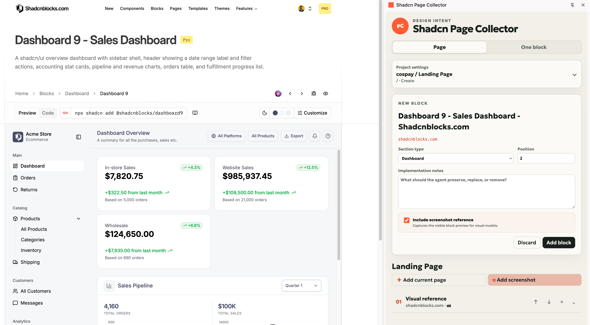

6. For an arbitrary visual fragment, click **Add screenshot**, drag a rectangle on the page, and release.

The same workflow works on ordinary websites and galleries: select only the region the coding agent should treat as a visual reference.

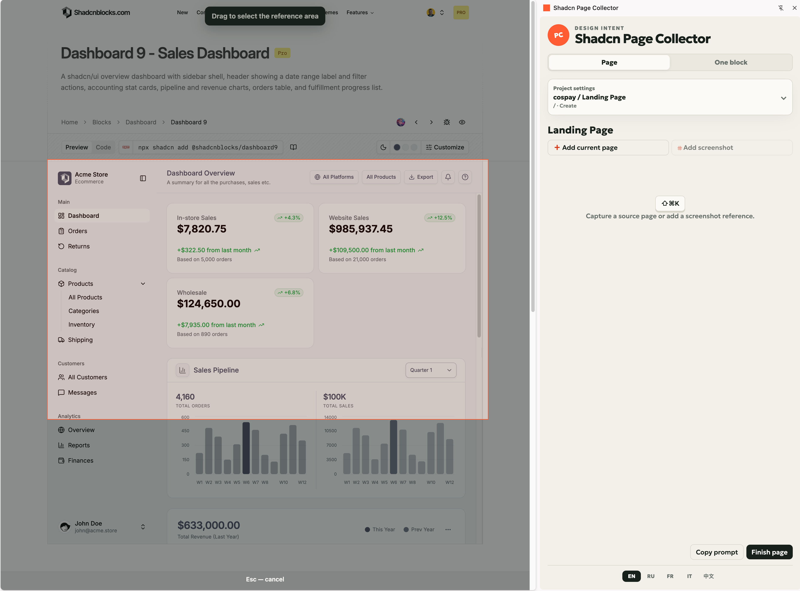

7. Expand items to inspect their source, edit and save implementation notes, review install metadata and screenshots, and reorder or remove items as needed. `Command+Enter` on macOS or `Ctrl+Enter` elsewhere also saves the notes field.

The outline may mix source blocks and screenshot-only references. Notes remain editable until the page is finished.

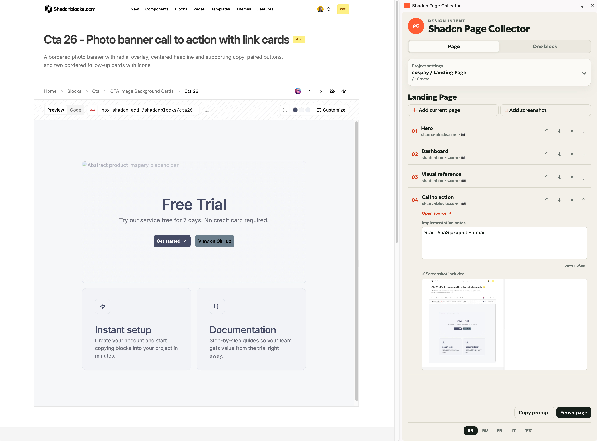

8. Click **Finish page**. Collector first writes the numbered package, then clears the finished page, its draft, and its page screenshots. The successful export card remains visible so you can copy the six-digit Collector number.

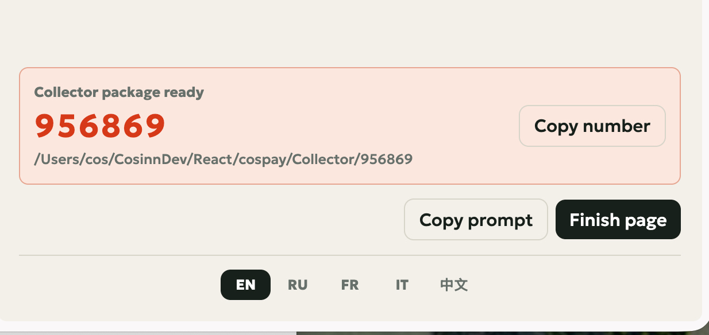

9. Open the same project in Codex or Claude Code and invoke the skill with that number.

### Capture one block

1. Switch to **One block**. No project folder is required.
2. Open a component or block on any HTTP/HTTPS page.
3. Click **Capture current block**, press the configured shortcut, or use the context menu.
4. Choose the section type, add implementation notes, and optionally include the visible screenshot.
5. Click **Prepare block**, review the source and preview, then click **Copy for agent**.
6. Paste into Codex, Claude Code, or another coding agent. The clipboard always contains structured JSON and, where supported, the captured PNG as an additional clipboard representation.

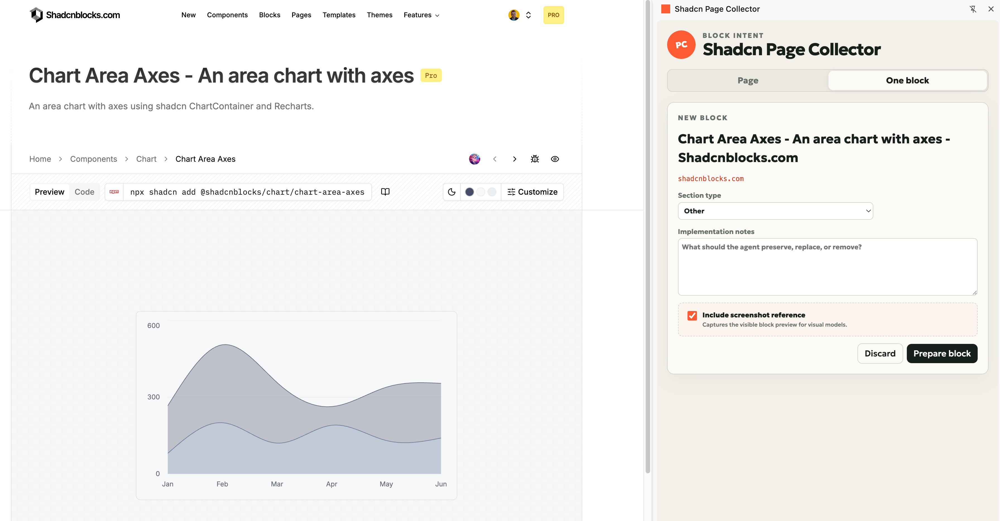

## Exported package

With a selected project directory:

```text
<project>/
└── Collector/
    ├── .gitignore
    └── 482731/
        ├── PAGE_SPEC.md
        ├── page-spec.json
        └── references/
            ├── 01-hero.png
            └── 02-visual-reference.png
```

Without a selected directory, the configured fallback is `~/Documents/Page Collector/<project>/Collector/<number>/`.

Every successful **Finish page** action creates a new collision-checked number and resets the page workspace only after the Native Host confirms that the package was written. A failed export leaves the collection untouched. `Collector/.gitignore` ignores all generated packages by default so URLs, notes, local paths, and screenshots are not accidentally committed to the target project. Remove or change that local ignore file only when you deliberately want to version a sanitized collection.

## Use with Codex or Claude Code

Open the selected project directory in the agent and use any supported form:

```text
$shadcn-collector 482731
/shadcn-collector 482731
Shadcn Collector 482731
Collector 482731
```

The skill:

1. resolves only the exact `Collector/482731/` folder in the current project or its parents;
2. validates `collectionId` in `page-spec.json`;
3. reads `PAGE_SPEC.md`, structured JSON, and every PNG in `references/`;
4. checks project instructions and existing design-system code;
5. uses authorized official installers when available, otherwise creates an original implementation from visible references;
6. verifies the finished page with the repository's lint, typecheck, tests, and visual workflow.

The canonical public skill is included at [`skills/shadcn-collector/`](skills/shadcn-collector/). It does not scan the home directory, sibling projects, credentials, or browser data.

The agent resolves the exact six-digit package, reads its Markdown, JSON, and reference images, and then implements the result under the target project's own instructions.

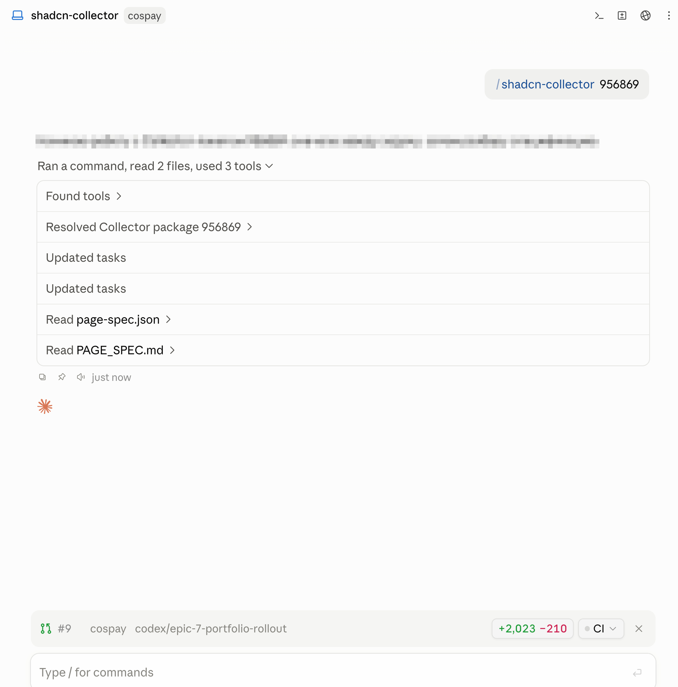

## Languages

English is the default. The bottom switcher supports:

| Switch | Language |
|---|---|
| EN | English |
| RU | Русский |
| FR | Français |
| IT | Italiano |
| 中文 | 简体中文 |

The selected locale controls every system label, status message, semantic section name, context-menu title, and exported Markdown instruction. Built-in placeholder names such as **Landing Page** also follow the locale. Names entered by the user and real folder names are intentionally preserved exactly as written.

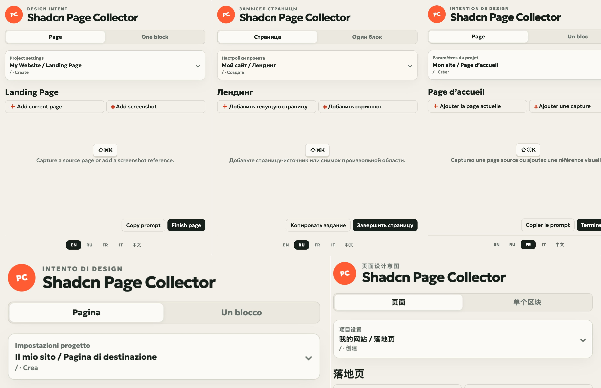

## What is public and what stays local

| Safe and expected in this repository | Must remain local and is ignored |
|---|---|
| Extension, Native Host, build scripts, tests, documentation | `.env` and any credentials or tokens |
| Canonical `shadcn-collector` skill | `Collector/` packages and `.page-collector/` state |
| `.env.example` with non-secret defaults and the public extension key | Personal project paths, private URLs, notes, selected text, screenshots |
| Geologica font under the SIL Open Font License | Paid/proprietary component source code and library credentials |
| Sanitized documentation screenshots | Chrome profile data, account information, and unsanitized captures |

The extension has no analytics, remote backend, advertising, or account system. See [`PRIVACY.md`](PRIVACY.md) and [`SECURITY.md`](SECURITY.md).

## Permissions

| Permission | Why it is needed |
|---|---|
| `activeTab` | Temporary access after an explicit user action |
| `scripting` | Inject and remove the rectangle-selection overlay |
| `storage`, `unlimitedStorage` | Store the current working page, standalone block, and explicitly captured PNGs locally |
| `sidePanel` | Show the Collector interface |
| `nativeMessaging` | Choose a macOS folder and write the finished local package |
| `contextMenus`, `commands` | User-initiated capture actions |

The manifest has no required `host_permissions`. The exact `<all_urls>` capability required by Chrome's `captureVisibleTab()` is declared through the configurable `CAPTURE_HOST_PERMISSION` value as an optional host permission. Chrome asks for it only after the user explicitly clicks **Add current page** or **Add screenshot** in the side panel; the capture cannot run if the request is declined. The separate `ALLOWED_HOST_PATTERN` controls where the context menu is shown. The keyboard shortcut and context menu continue to use temporary `activeTab` access. The granted optional access can be revoked in Chrome's extension settings at any time.

Source websites continue to make their own normal browser requests; Collector does not add network requests or upload collected data.

## Configuration and development

Copy `.env.example` to `.env`; never commit `.env`. Available variables configure the app name, Native Host name, stable public extension key, allowed context-menu URL pattern, optional screenshot capture permission, fallback export directory, default route, Chrome application, Collector directory, and Codex/Claude skill locations.

```bash
npm run build
npm run check
npm run install:host
npm run package
```

Source files live in `extension/`; `dist/extension/` and `release/` are generated and ignored. After rebuilding, click **Reload** for the unpacked extension on `chrome://extensions`.

See [`docs-shadcn-pagebuilder-chrome/architecture.md`](docs-shadcn-pagebuilder-chrome/architecture.md) and [`CONTRIBUTING.md`](CONTRIBUTING.md) for implementation and contribution details.

## License

Project code is available under the [MIT License](LICENSE). The bundled Geologica variable font is licensed under the SIL Open Font License; see [`extension/fonts/OFL.txt`](extension/fonts/OFL.txt).
